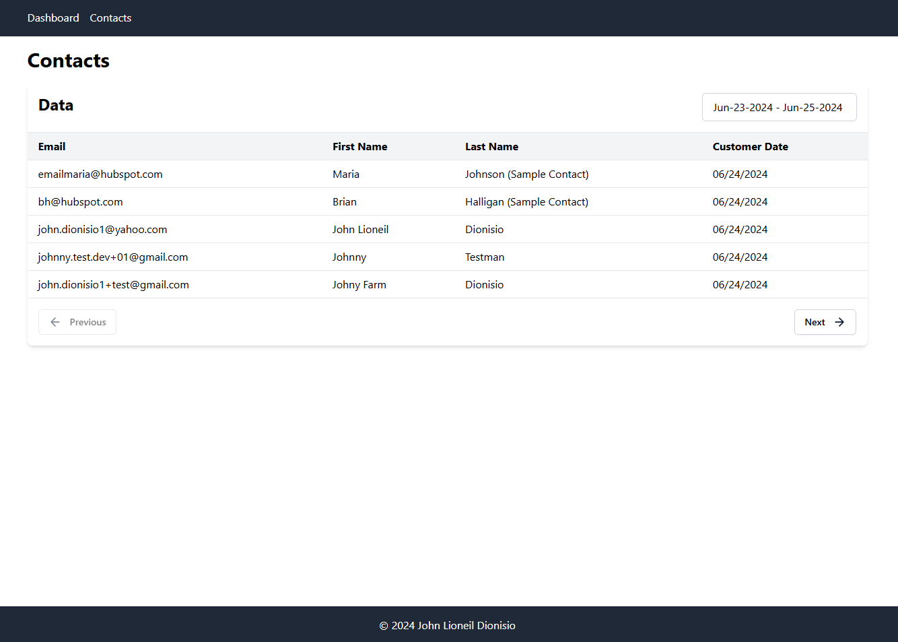

# Coding Trial



Written in Plain PHP + ReactJS

## Prerequisites

* PHP 8.2+
* Composer v2.7+
* Node v18+

## Preview Demo

Install dependencies:

```bash
composer install
npm install
```

Copy `.env` file and populate:

```bash
cp .env.example .env
```

Build the asset files if no `public/dist` folder is found.

```bash
composer run-script build
```

Then run a PHP server:

```bash
php -S localhost:8000 -t public/
```
